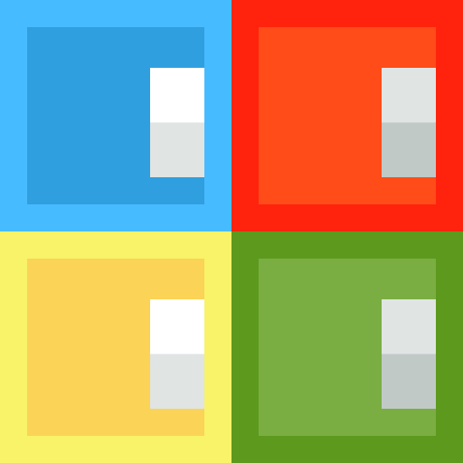

# Simon Says Game

A simple web-based **Simon Says** memory game. Test your memory by repeating the color sequence as it grows with each level.

---

## How to Play

1. **Start the Game**  
   Click the **Start Game** button to begin.

2. **Watch the Sequence**  
   The game will flash a sequence of colored buttons.  
   Remember the order!

3. **Repeat the Sequence**  
   Click the colored buttons in the same order.  
   Each level adds a new color to the sequence.

4. **Game Over**  
   If you make a mistake, the game ends and shows your score.  
   Click **Start Game** to try again.

5. **Reset**  
   Click **Reset Game** to restart at any time.

---

## Files

- `gameindex.html` – Main HTML file  
- `gamestyle.css` – Styles for the game  
- `gamescript.js` – Game logic  
- `logo.png` – Game icon

---

## Preview

